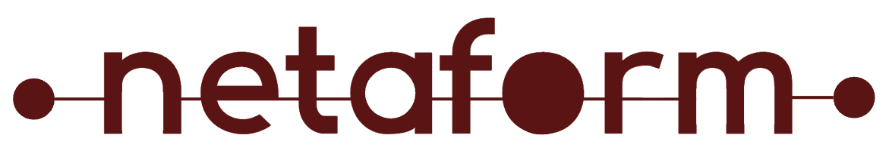

<p align="center">
  
</p>

# Netaform - Network Automation, Endlessly Evolving

A public, evolving network automation portfolio built on [Containerlab](https://containerlab.dev). Each phase introduces a realistic network scenario and layers in new tools.

## Phases

| Phase | Scenario                                            | Key Tools               | Status         |
| ----- | --------------------------------------------------- | ----------------------- | -------------- |
| 1     | [Enterprise Branch Office](phase-01-branch-office/) | Containerlab, cEOS, FRR | 🔧 In Progress |

_More phases coming — follow the journey._

## Getting Started

### Prerequisites

- Linux (Ubuntu recommended) or macOS with [OrbStack](https://orbstack.dev)
- [Docker](https://docs.docker.com/engine/install/)
- [Containerlab](https://containerlab.dev/install/)
- Arista cEOS image (free with [Arista account](https://www.arista.com/en/user-registration))
- 8GB+ RAM recommended

### Quick Start

```bash
# Clone the repo
git clone https://github.com/rushivt/netaform.git
cd netaform/phase-01-branch-office

# Deploy the lab
sudo containerlab deploy -t topology/topology.clab.yml

# Destroy the lab
sudo containerlab destroy -t topology/topology.clab.yml
```

## About

Built by [Tirupathi Rushi Vedulapurapu](https://linkedin.com/in/rushivt) — documenting the journey of building real-world network automation skills, one phase at a time.
