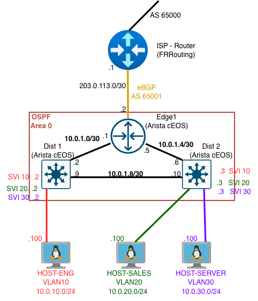

<p align="center">
  
</p>

# Phase 1: Enterprise Branch Office

## Scenario

A small company branch office that needs internet access, internal department segmentation, and basic redundancy. This is one of the most common network designs in the real world — an edge router peering with an ISP, a pair of distribution switches handling internal routing, and hosts separated by VLANs.

## Topology



## Devices

| Device      | Image        | Role                                          |
| ----------- | ------------ | --------------------------------------------- |
| ISP-RTR     | FRRouting    | L3 router — simulates ISP, eBGP peer          |
| EDGE-1      | Arista cEOS  | Border router — eBGP to ISP, OSPF to internal |
| DIST-1      | Arista cEOS  | L3 switch — OSPF, VLANs, inter-VLAN routing   |
| DIST-2      | Arista cEOS  | L3 switch — OSPF, VLANs, inter-VLAN routing   |
| HOST-ENG    | Alpine Linux | Engineering department host (VLAN 10)         |
| HOST-SALES  | Alpine Linux | Sales department host (VLAN 20)               |
| HOST-SERVER | Alpine Linux | Server/infrastructure host (VLAN 30)          |

## Protocols

- **eBGP** between EDGE-1 (AS 65001) and ISP-RTR (AS 65000)
- **OSPF Area 0** between EDGE-1, DIST-1, and DIST-2
- **VLANs** for department segmentation (10: Engineering, 20: Sales, 30: Servers)

## IP Addressing Plan

See [docs/ip-plan.md](docs/ip-plan.md)

## Interview with Bitt

<table>
<tr>
<td width="120" align="center">

</td>
<td>
BGP, OSPF, VLANs, FRRouting, cEOS — too many acronyms flying around? Let <strong>Bitt</strong> break it down. In this interview, Bitt walks through the entire topology, explains how a packet actually travels through the branch office, and tells you why each tool was picked — all without a single textbook definition.
<br><br>
📖 <a href="docs/conversations/bitt-branch-office.md">Bitt gets real about the Branch Office</a>
</td>
</tr>
</table>

## How to Deploy

```bash
cd topology
sudo containerlab deploy -t topology.clab.yml
```

## How to Destroy

```bash
sudo containerlab destroy -t topology/topology.clab.yml
```

## Lessons Learned

These are real issues we hit during deployment — documented so you don't waste time on the same problems.

**1. ARM vs x86 cEOS image**
If you're on Apple Silicon (M1/M2/M3/M4), the standard `cEOS-lab` image will not work. It's compiled for x86 and fails with `unsupported OS Arch` errors. You need the ARM-native image — look for `cEOSarm-lab` on the Arista downloads page.

**2. Config file paths in Containerlab YAML**
The topology YAML lives inside the `topology/` folder. All config file references need `../` to reach the `configs/` folder one level up. Without this, Containerlab throws "no such file or directory" errors.

**3. FRR requires explicit route-maps for BGP**
Unlike Arista and Cisco, FRRouting blocks all BGP routes by default if no route-map is attached. The BGP session comes up fine but shows `(Policy)` instead of route counts. The fix is adding a `PERMIT-ALL` route-map and applying it to the neighbor. This is a real multi-vendor gotcha — Cisco and Arista are permissive by default, FRR and Juniper are strict.

**4. File permissions after Containerlab runs**
Containerlab bind-mounts config files into containers as root. After destroying the lab, some files may be owned by root, causing `Permission denied` on git operations. Fix with `sudo chown $USER:$USER <file>`.

## Design Decisions

**Single-homed hosts** — Each host connects to one distribution switch. This keeps Phase 1 simple and realistic for workstation-level devices. Dual-homing with MLAG is planned for a future phase.

**FRR as ISP** — In real life, you never control the ISP side. Using FRR (a different vendor from the internal Arista network) models this reality and introduces multi-vendor experience from day one.

**L3 switches for distribution** — DIST-1 and DIST-2 run both switching (VLANs) and routing (OSPF, SVIs). This is standard enterprise design where the distribution layer handles inter-VLAN routing.

**/30 subnets for point-to-point links** — Industry standard. Wastes no addresses and clearly signals "this is a link between two devices."

**RFC 5737 addressing for ISP link** — 203.0.113.0/24 is reserved for documentation. Using it shows proper addressing practices instead of accidentally using real public IP space.
