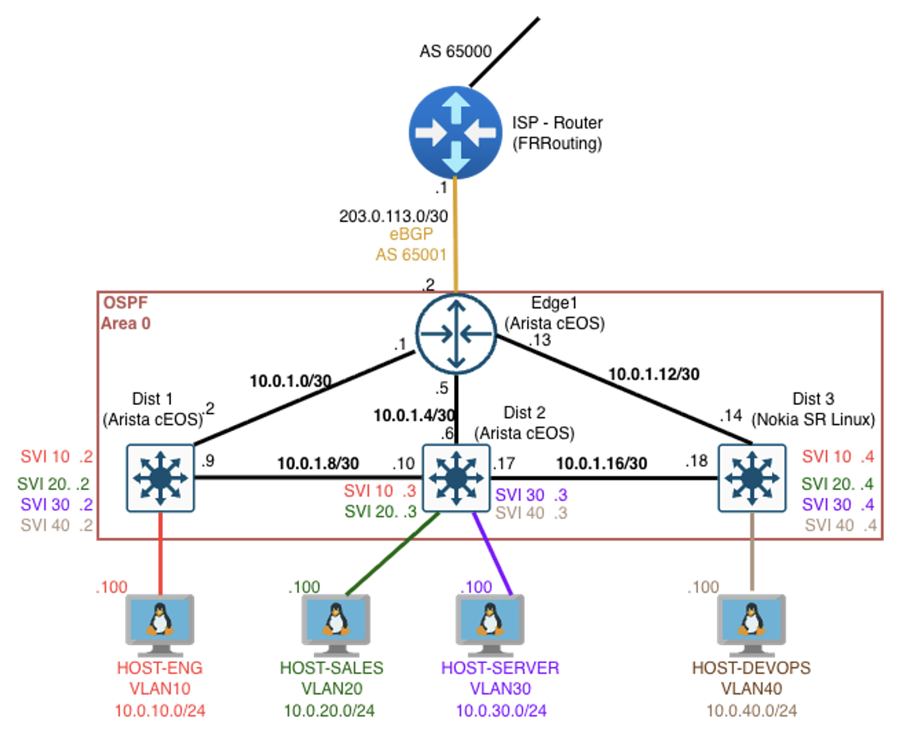

<p align="center">
  
</p>

# Phase 3: Network Programmability — NETCONF, Multi-Vendor, and Beyond CLI

## Scenario

The branch office network from Phase 2 is fully automated with Ansible — but Ansible pushes config and walks away. The network team needs deeper programmatic access: the ability to query live device state, detect unauthorized config changes, and make transactional changes with rollback safety. Phase 3 introduces NETCONF as the primary programmability interface, adds a Nokia SR Linux switch to create a multi-vendor environment, and builds Python tools that talk directly to network devices through their YANG-modeled APIs.

## What Changed from Phase 2

- **dist-3 (Nokia SR Linux)** added as a third distribution switch — the first non-Arista device in the topology, creating a real multi-vendor environment
- **host-devops** added on VLAN 40, connected to dist-3
- **VLAN 40 (DevOps)** added across all distribution switches
- **NETCONF enabled** on all four network devices (three Arista cEOS + one Nokia SR Linux)
- **OpenConfig YANG models enabled** on Nokia SR Linux for cross-vendor queries
- **New point-to-point links**: edge-1 to dist-3 (10.0.1.12/30), dist-2 to dist-3 (10.0.1.16/30)
- Phase 2's Ansible automation extended with a dedicated Nokia SR Linux role using the `nokia.srlinux` collection

## Topology



## Devices

| Device      | Image          | Role                                          |
| ----------- | -------------- | --------------------------------------------- |
| ISP-RTR     | FRRouting      | L3 router — simulates ISP, eBGP peer          |
| EDGE-1      | Arista cEOS    | Border router — eBGP to ISP, OSPF to internal |
| DIST-1      | Arista cEOS    | L3 switch — OSPF, VLANs, inter-VLAN routing   |
| DIST-2      | Arista cEOS    | L3 switch — OSPF, VLANs, inter-VLAN routing   |
| DIST-3      | Nokia SR Linux | L3 switch — OSPF, VLANs, inter-VLAN routing   |
| HOST-ENG    | Alpine Linux   | Engineering department host (VLAN 10)         |
| HOST-SALES  | Alpine Linux   | Sales department host (VLAN 20)               |
| HOST-SERVER | Alpine Linux   | Server/infrastructure host (VLAN 30)          |
| HOST-DEVOPS | Alpine Linux   | DevOps department host (VLAN 40)              |

## Interview with Bitt

<table>
<tr>
<td width="120" align="center">

</td>
<td>
NETCONF, YANG, OpenConfig, candidate datastores, multi-vendor — Phase 3 gets deep. Bitt sat down with two guests this time: NETCONF the protocol, and SR Linux the Nokia operating system. There was frustration, namespace errors, a few jokes, and one CLI command that saved the entire phase.
<br><br>
🎙 <a href="docs/conversations/bitt-programmability.md">Bitt meets NETCONF and SR Linux</a>
</td>
</tr>
</table>

## Tools Used

| Tool                    | Purpose                                                 |
| ----------------------- | ------------------------------------------------------- |
| Python 3                | Scripting language for all programmability tools        |
| ncclient                | Python NETCONF client library                           |
| pyang                   | YANG model tree renderer for exploring data models      |
| xmltodict               | XML to Python dictionary parsing                        |
| PyYAML                  | YAML parsing for intended state comparison              |
| Nokia SR Linux          | Multi-vendor target (NETCONF + JSON-RPC)                |
| Arista cEOS             | Multi-vendor target (NETCONF + eAPI)                    |
| Ansible + nokia.srlinux | Nokia SR Linux configuration via model-driven interface |

## How It Works

Phase 3 builds seven Python scripts that interact with network devices through NETCONF (RFC 6241). The scripts are organized by function:

| Script                       | What It Does                                                                                                     |
| ---------------------------- | ---------------------------------------------------------------------------------------------------------------- |
| test_connection.py           | Verifies NETCONF connectivity to both Arista and Nokia devices                                                   |
| get_ospf_neighbors.py        | Fetches OSPF neighbor table from dist-3 using Nokia native YANG                                                  |
| get_interfaces.py            | Fetches interface status and counters from dist-3 using Nokia native YANG                                        |
| get_interfaces_openconfig.py | Fetches interfaces from BOTH Arista and Nokia using OpenConfig YANG — same script, same filter, both vendors     |
| set_acl.py                   | Creates/removes an ACL on dist-3 with full NETCONF transaction (lock, edit-config, validate, commit, unlock)     |
| maarpu.py                    | Config drift detector — compares running config (via NETCONF) against Ansible host_vars (single source of truth) |
| atomicity_demo.py            | Demonstrates NETCONF transaction atomicity — success case and failure case with rollback                         |

## YANG Models

Two types of YANG models were used. See [docs/yang-reference.md](docs/yang-reference.md) for the full reference.

**Vendor-native (Nokia SR Linux):** Used for OSPF neighbors, interface details, ACL management, drift detection, and atomicity demo. These models provide comprehensive feature coverage and are the primary models used by Nokia's own tooling. The `diff netconf-rpc` CLI feature on SR Linux was instrumental in discovering the correct namespaces and XML structures for each model.

**OpenConfig (vendor-neutral):** Used for the multi-vendor interface query. The same NETCONF filter returned structured interface data — names, admin/oper status, counters, and IP addresses — from both Arista cEOS and Nokia SR Linux without any vendor-specific code paths.

## Quick Start

```bash
cd ansible

# Deploy the topology
make deploy

# Bootstrap all devices (eAPI + NETCONF on cEOS, NETCONF + JSON-RPC + OpenConfig on SR Linux)
make bootstrap

# Configure cEOS devices
make network

# Configure Nokia SR Linux
make srlinux

# Configure Alpine hosts
make hosts

# Run NETCONF scripts
cd ../scripts/netconf
python3 test_connection.py
python3 get_ospf_neighbors.py dist-3
python3 get_interfaces_openconfig.py edge-1 dist-3
python3 maarpu.py dist-3
python3 atomicity_demo.py

# Destroy the lab
cd ../../ansible
make clean
```

## Project Structure

```
phase-03-programmability/
├── topology/
│   └── topology.clab.yml            # Containerlab topology (9 containers)
├── ansible/
│   ├── ansible.cfg
│   ├── bootstrap.sh                  # Enables eAPI/NETCONF/JSON-RPC/OpenConfig
│   ├── Makefile
│   ├── network.yml                   # cEOS playbook
│   ├── srlinux.yml                   # Nokia SR Linux playbook
│   ├── hosts.yml                     # Alpine hosts playbook
│   ├── inventory.yml
│   ├── group_vars/
│   ├── host_vars/
│   │   └── dist-3/vars.yml           # Also serves as Maarpu's intended state
│   └── roles/
│       ├── base/                      # cEOS: hostname, DNS, NTP, banner, eAPI, NETCONF
│       ├── interfaces/                # cEOS: VLANs, routed/access interfaces, SVIs
│       ├── routing/                   # cEOS: OSPF, BGP
│       ├── security/                  # cEOS: management ACL
│       ├── validate/                  # cEOS: show commands for verification
│       └── srlinux/                   # Nokia: model-driven config via YANG paths
├── scripts/
│   ├── inventory.py                   # Dynamic device IP resolution from Containerlab
│   ├── netconf/
│   │   ├── test_connection.py
│   │   ├── get_ospf_neighbors.py
│   │   ├── get_interfaces.py
│   │   ├── get_interfaces_openconfig.py
│   │   ├── set_acl.py
│   │   ├── maarpu.py
│   │   └── atomicity_demo.py
│   └── yang/
│       ├── models/                    # YANG files extracted from SR Linux container
│       ├── oc-interfaces-tree.txt
│       ├── oc-network-instance-tree.txt
│       ├── srl-interfaces-tree.txt
│       └── srl-ospf-tree.txt
├── diagrams/
├── docs/
│   ├── ip-plan.md
│   └── yang-reference.md
└── requirements.txt
```

## Lessons Learned

**1. Nokia SR Linux NETCONF requires explicit setup in Containerlab**
SR Linux v26.3.1 required manual NETCONF enablement: a dedicated SSH server instance on port 830, an AAA role with explicit NETCONF operation permissions, and a named netconf-server instance. This security-first design means every management protocol and operation is explicitly permitted rather than enabled by default. The setup is handled in the bootstrap script.

**2. The `diff netconf-rpc` command is essential for SR Linux NETCONF development**
SR Linux's CLI can generate the exact NETCONF XML — with correct namespaces, element structure, and hierarchy — for any candidate config change. This was the primary method for building NETCONF filters throughout Phase 3 and is far more efficient than manually parsing YANG files for namespace URIs.

**3. Arista and Nokia use fundamentally different Ansible automation models**
Arista uses CLI-driven automation: Jinja2 templates render CLI commands pushed via eAPI. Nokia uses model-driven automation: YANG paths and values sent directly via JSON-RPC. The Nokia role has no templates directory — configuration is expressed as structured data, not CLI text.

**4. OpenConfig validated for multi-vendor interface queries**
The same OpenConfig NETCONF filter returned structured interface data from both Arista cEOS and Nokia SR Linux — names, admin/oper status, counters, and IP addresses. Vendor-native models were used for features like OSPF, ACLs, and drift detection where direct access to the full vendor data model was the priority.

**5. Nokia SR Linux requires OpenConfig to be explicitly enabled**
SR Linux does not expose OpenConfig models by default. Enabling requires `system management openconfig admin-state enable`, which depends on LLDP being configured first. This dependency is handled in the bootstrap script.

**6. NETCONF's transactional model provides real safety guarantees**
Candidate datastore isolation, lock/unlock, validate, and atomic commit ensure that invalid changes never reach the running config. The atomicity demo showed that one bad change in a batch causes the entire batch to be rejected — running config stays untouched.

**7. Cross-vendor host reachability limitation with overlapping VLAN subnets**
Hosts connected to Nokia SR Linux (dist-3) cannot reach hosts on Arista cEOS switches (dist-1, dist-2) across VLAN subnets because all distribution switches have SVIs in the same subnets without Layer 2 trunk links between them. Routed traffic between switches works correctly — loopbacks, point-to-point links, and ISP reachability all function as expected. Extending VLAN reachability across switches requires Layer 2 trunking or VXLAN/EVPN overlay, which is planned for Phase 9.

## Design Decisions

**NETCONF as the primary programmability interface** — Chosen for its transactional capabilities: candidate datastore isolation, lock/unlock, validate before commit, and atomic all-or-nothing commits. These features make it the preferred protocol for programmatic configuration management in production.

**Nokia SR Linux as the multi-vendor addition** — Freely available as a container image, runs natively on ARM (Apple Silicon), and represents a vendor with growing data center market presence. OSPF adjacencies between Arista and Nokia formed on the first attempt.

**Vendor-native YANG for deep feature access, OpenConfig for cross-vendor** — Vendor-native models provide full coverage of every platform feature. OpenConfig provides the cross-vendor interface queries. This layered approach reflects how multi-vendor automation works in practice.

**Ansible host_vars as Maarpu's intended state** — Rather than maintaining a separate intended config file, Maarpu reads directly from the same Ansible host_vars used to configure the device. One source of truth, not two.

**HTTP for Nokia SR Linux JSON-RPC** — JSON-RPC over HTTPS required TLS profile configuration that had issues in the containerized environment. HTTP on port 80 was used for Ansible connectivity and JSON-RPC access. In production, HTTPS with proper certificate management is the standard.

**Separate NETCONF sessions per transaction** — Each transactional operation uses its own NETCONF session to avoid session state issues after lock/unlock cycles.
