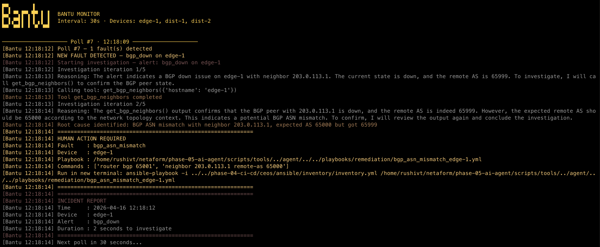
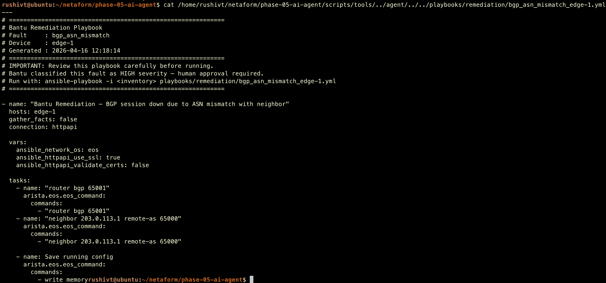
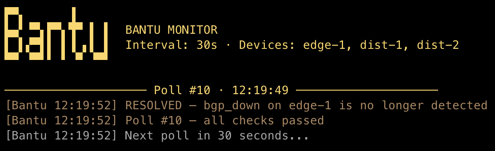

<p align="center">
  
</p>

# Phase 5: AI Troubleshooting Agent — Bantu

## Scenario

The branch office network from Phases 1–4 is fully automated, programmatically managed, and CI/CD tested. But when something breaks at 2am, someone still has to wake up, SSH into devices, and figure out what went wrong. Phase 5 introduces **Bantu** — an always-on AI agent that watches the network continuously, detects faults automatically, and either fixes them or generates a ready-to-run Ansible playbook for human review. No manual intervention. No paging engineers for known, safe fixes.

Bantu means *helper* in Telugu. That's exactly what it is.

<p align="center">
  
</p>

## What Changed from Phase 4

- **Always-on monitoring loop** — Bantu polls all devices every 30 seconds checking BGP, interfaces, OSPF, reachability, and static route blackholes
- **Autonomous fault detection** — no manual trigger, no scenario selection, Bantu detects faults from live device state
- **Human-in-the-loop severity model** — LOW severity faults auto-fixed via Netmiko, HIGH severity generates an Ansible playbook and waits for human approval
- **Fault tracker** — known faults are tracked across polls, no repeated investigations, just reminders until resolved
- **RESOLVED detection** — when a fault clears, Bantu announces it and returns to clean state
- **Groq + Llama 3.3 70B** — LLM reasons through faults using real device data, chains tool calls like a real engineer would

## Topology

Same branch office topology as Phases 1–4 — ISP router (FRR) peering with edge-1 via eBGP, two distribution switches running OSPF, three department hosts on separate VLANs.

## How Bantu Works

### The Agent Loop

```
Poll devices every 30s
    ↓
Compare live state to expected state
    ↓
Fault detected?
    ├── NO  → "all checks passed"
    └── YES → Known fault? → Remind engineer (no re-investigation)
                   ↓
              New fault? → Investigate with LLM tool-calling
                   ↓
              LOW severity  → Auto-fix via Netmiko → Verify → Log
              HIGH severity → Generate Ansible playbook → Notify engineer
```

### Severity Model

| Severity | Faults | Action |
|----------|--------|--------|
| LOW | Interface admin shutdown | Auto-fix with `no shutdown`, verify, log |
| HIGH | BGP ASN mismatch, OSPF area mismatch, Static route blackhole | Generate Ansible playbook, notify engineer, remind each poll |

### Tool-Calling Pattern

Bantu uses raw Groq API with no frameworks. The LLM receives an alert and decides which tools to call. Results are fed back to the LLM which chains further tool calls until it identifies the root cause. The LLM never guesses — it must call at least one tool before concluding.

```
Alert received
    ↓
LLM decides: "call get_bgp_neighbors(edge-1)"
    ↓
Python executes tool against real device
    ↓
Results sent back to LLM
    ↓
LLM analyzes: "ASN is 65999, expected 65000 — BGP ASN mismatch"
    ↓
Root cause identified → severity classified → action taken
```

### Available Tools

| Tool | Purpose |
|------|---------|
| `get_bgp_neighbors` | BGP peer state via NAPALM |
| `get_interfaces` | Interface up/down state via NAPALM |
| `get_ospf_config` | OSPF neighbor table and process config via CLI |
| `get_static_routes` | Static routes including Null0 blackholes via CLI |
| `get_route_table` | Full routing table via NAPALM |
| `get_device_facts` | Device uptime, model, OS version via NAPALM |
| `ping_device` | End-to-end reachability test via NAPALM |
| `get_arp_table` | ARP table via NAPALM |

## Demo

### Fault Detected — Investigation Begins


Bantu detects a BGP fault on the next poll cycle and immediately begins investigation — calling tools, reading actual device state, chaining further queries based on what it finds.

### Root Cause Identified — Human Action Required



Bantu identifies the BGP ASN mismatch with actual values from the device (65999 vs expected 65000), classifies severity as HIGH, and generates a remediation playbook. The engineer gets the playbook path and exact fix commands — ready to review and run.

### Generated Ansible Playbook



Bantu generates a complete, valid Ansible playbook using a Jinja2 template. Every playbook includes the fault type, affected device, timestamp, and the actual fix commands identified during investigation.

### Fault Resolved



Once the fault is cleared — either by the engineer running the playbook or Bantu's auto-fix — Bantu detects the resolution on the next poll and announces it. Clean loop.

## Fault Scenarios

| Fault | Injection | Severity | Bantu Action |
|-------|-----------|----------|--------------|
| Interface shutdown | `shutdown` on Ethernet1 | LOW | Auto-fix: `no shutdown`, verify |
| BGP ASN mismatch | Wrong `remote-as` configured | HIGH | Playbook: correct ASN |
| OSPF area mismatch | Wrong area on dist-1 | HIGH | Playbook: correct area |
| Static route blackhole | `ip route 10.0.30.0/24 Null0` | HIGH | Playbook: `no ip route` |

## Tools Used

| Tool | Purpose |
|------|---------|
| Groq API | LLM inference — Llama 3.3 70B |
| NAPALM | Vendor-neutral device state retrieval (EOS driver) |
| Netmiko | SSH-based config push for auto-remediation |
| Jinja2 | Ansible playbook generation from templates |
| python-dotenv | Environment variable management |
| colorama | Colored terminal output |
| Containerlab | Network topology orchestration (Phase 4 topology reused) |

## Quick Start

```bash
cd phase-05-ai-agent

# Create virtual environment
python3 -m venv venv
source venv/bin/activate
pip install -r requirements.txt

# Set up credentials
cp .env.example .env
# Edit .env with your GROQ_API_KEY, DEVICE_USERNAME, DEVICE_PASSWORD

# Deploy Phase 4 topology
cd ../phase-04-ci-cd/ceos
sudo containerlab deploy -t topology/topology.clab.yml
cd ../../phase-05-ai-agent

# Run smoke test
python scripts/smoke_test.py

# Start always-on monitor
python scripts/monitor.py

# Or run single investigation manually
python scripts/agent/bantu.py
```

## Fault Injection for Demo

```bash
# Inject a fault
./demo/inject_faults.sh interface_down
./demo/inject_faults.sh bgp_asn_mismatch
./demo/inject_faults.sh ospf_area_mismatch
./demo/inject_faults.sh acl_blocking

# Restore network (HIGH severity faults only — LOW are auto-fixed by Bantu)
./demo/restore_network.sh bgp_asn_mismatch
./demo/restore_network.sh ospf_area_mismatch
./demo/restore_network.sh acl_blocking
```

## Project Structure

```
phase-05-ai-agent/
├── bantu-logo.png
├── requirements.txt
├── .env                              # API key + credentials (never committed)
├── .env.example                      # Template for required variables
├── .gitignore
├── scripts/
│   ├── inventory.py                  # Device IP resolution from Phase 4 inventory
│   ├── smoke_test.py                 # Pre-flight connectivity check
│   ├── monitor.py                    # Always-on monitoring loop
│   ├── tools/
│   │   └── network_tools.py          # NAPALM + CLI tool functions
│   └── agent/
│       ├── bantu.py                  # Main agent orchestrator
│       ├── groq_client.py            # Groq API + system prompt
│       ├── fault_definitions.py      # Severity rules + fix commands
│       ├── playbook_generator.py     # Jinja2 playbook generation
│       └── remediation.py            # Netmiko auto-fix
├── playbooks/
│   ├── remediation_template.j2       # Jinja2 template for playbooks
│   └── remediation/                  # Generated playbooks (gitignored)
├── demo/
│   ├── inject_faults.sh              # Fault injection scripts
│   └── restore_network.sh            # Network restore scripts
└── docs/
    ├── screenshot-fault-detected.png
    ├── screenshot-investigation.png
    ├── screenshot-playbook.png
    ├── screenshot-resolved.png
    └── conversations/
        └── bitt-bantu.md
```

## Design Decisions

**Raw Groq API over LangChain** — No framework abstractions. Every line of the agent loop is explicit Python. When an interviewer asks how tool-calling works, there is a clear answer for every line of code. LangChain would hide the mechanics that make this interesting.

**NAPALM over NETCONF** — Phase 3 proved NETCONF works but is operationally fragile on cEOS containers. NAPALM uses eAPI over HTTPS — the same transport Ansible uses in Phase 4, proven stable across 40 CI/CD tests. Reliability matters more than protocol purity for an always-on agent.

**Netmiko for auto-remediation** — NAPALM is excellent for reading state but Netmiko gives more direct control for pushing config changes. For a LOW severity auto-fix that needs to happen in seconds, Netmiko's `send_config_set()` is the right tool.

**Human-in-the-loop for HIGH severity** — Routing policy changes (BGP, OSPF, static routes) have network-wide blast radius. Bantu generates the playbook and waits. This is not a limitation — it is the correct engineering decision. Even enterprise AIOps platforms require human approval for policy changes.

**Fault tracker across polls** — Without tracking, Bantu would re-investigate the same HIGH severity fault every 30 seconds, burning Groq API calls and spamming the engineer. The tracker remembers known faults, reminds without re-investigating, and clears automatically when the fault resolves.

## Lessons Learned

**1. LLMs need explicit constraints to be reliable agents**
Without strict system prompt rules ("you MUST call at least one tool before concluding"), the LLM would sometimes reason to a conclusion without calling any tools — producing plausible-sounding but fabricated root causes. Explicit constraints and `temperature=0` made behavior consistent.

**2. NAPALM getters don't cover everything**
`get_ospf_neighbors()` returns VRF instance data, not OSPF neighbor state. For OSPF diagnosis, `device.cli(["show ip ospf neighbor"])` gave the LLM exactly what it needed. Knowing when to drop below the abstraction layer is as important as knowing the abstraction exists.

**3. cEOS has hardware limitations**
`ip access-group` on SVI interfaces is not supported in cEOS — it requires hardware TCAM that containers don't have. The ACL scenario was redesigned as a static route blackhole which is equally realistic and fully supported. Knowing platform limitations before designing scenarios saves debugging time.

**4. JSON parsing needs to be defensive**
LLMs sometimes prepend explanatory text before JSON even when instructed not to. The `_extract_json()` function uses regex to find the JSON object anywhere in the response rather than assuming it starts at position 0. This made the agent reliable across hundreds of API calls.

**5. Fault correlation matters**
When an interface goes down, BGP also goes down — two alerts for one root cause. The monitor detects both and investigates the first (BGP), which traces to the interface and fixes it. The second alert (interface) finds everything already resolved and correctly reports "transient issue." Downstream symptoms resolving after root cause fix is expected behavior, not a bug.

## Future Upgrades

**Fault coverage** — Expand beyond 4 fault types to cover interface error rates, BGP route flaps, high CPU/memory, MTU mismatches, and authentication failures. Each new fault is a new entry in `fault_definitions.py` and a new check in `monitor.py`.

**Real alert integration** — Wire Bantu to existing monitoring systems via webhooks — Grafana alerts, PagerDuty, or Slack slash commands. Bantu becomes the responder rather than the detector.

**Cross-device correlation** — A fault on edge-1 affects dist-1 and dist-2 downstream. A smarter agent would correlate alerts across devices, suppress child alerts when the root cause is found on the parent, and investigate the topology rather than individual devices.

**Incident history** — Log every handled fault to a database. Over time patterns become visible — recurring interface flaps, BGP instability at specific times — turning reactive troubleshooting into proactive maintenance.

**Notification integration** — For HIGH severity faults, send a Slack message or email with the playbook path and fix commands instead of only printing to terminal.

**Fine-tuned model** — Replace the general-purpose Llama model with one fine-tuned on network operations data — device configs, show command outputs, historical incident reports, and vendor documentation. The model would know your topology, your IP scheme, and your remediation policies without needing them in the system prompt. Groq supports custom model deployment via their enterprise tier.

**Local model for air-gapped environments** — Many enterprise networks have no internet access. Running a quantized model locally via Ollama uses the same tool-calling pattern with a one-line client swap — no changes to agent logic.

**Phase 9 fabric support** — When Netaform reaches the VXLAN-EVPN data center fabric, Bantu needs new tools for EVPN route checks, VXLAN tunnel state, and BGP EVPN address family monitoring. The architecture supports this cleanly.

## Interview with Bitt

<table>
<tr>
<td width="120" align="center">

</td>
<td>
AI agents, tool-calling, autonomous remediation, human-in-the-loop — Phase 5 has more moving parts than a Swiss watch and more opinions than a Reddit thread. Bitt sat down with Bantu himself to find out what it's actually like being an AI that fixes networks at 2am.
<br><br>
📖 <a href="docs/conversations/bitt-bantu.md">Bitt meets Bantu</a>
</td>
</tr>
</table>
