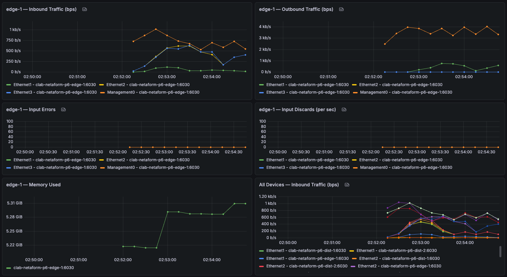
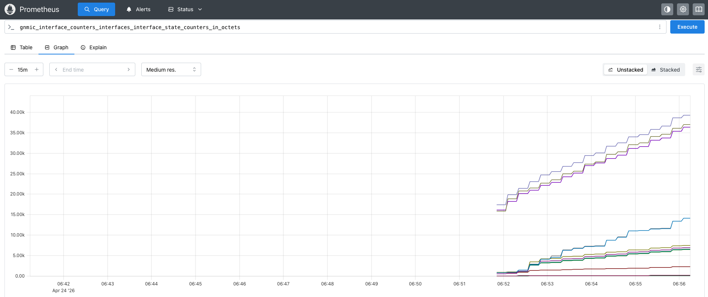
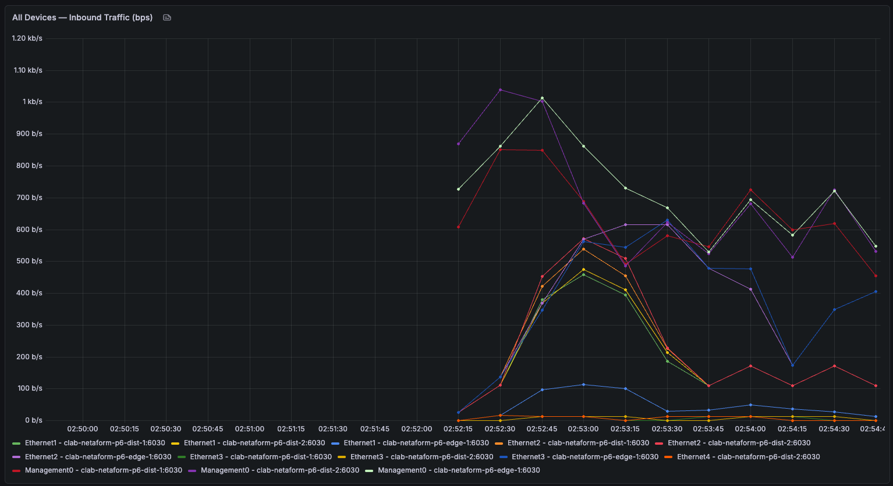

<p align="center">
  
</p>

# Phase 6: Streaming Telemetry — gNMI, Prometheus, Grafana

## Scenario

Bantu (Phase 5) polls the network every 30 seconds and tells us whether things are up or down. That's enough to catch failures, but it doesn't tell us how the network is _performing_ between those checks. If interface errors climb from 0 to 500 per minute over an hour, Bantu won't flag it — the interface is still technically up. Phase 6 fills that gap with real-time streaming telemetry. Network devices push metrics continuously, a collector stores them, and dashboards visualize them. The network gets an EKG, not just a pulse check.

## What Changed from Phase 5

- **Streaming telemetry replaces polling** — devices push data via gNMI instead of being queried via NAPALM
- **Time-series database** — Prometheus stores every metric with a timestamp, making historical analysis possible
- **Always-on dashboards** — Grafana renders live graphs of interface throughput, errors, discards, and memory
- **OpenConfig YANG** — standard vendor-neutral data models, browsable with pyang
- **All auto-provisioned** — dashboards and datasources come up on `make deploy`, no manual UI clicking

## Topology

Same branch office topology as Phases 1–4, now extended with a telemetry stack running as additional Containerlab nodes: gnmic (collector), Prometheus (time-series storage), and Grafana (visualization). All monitoring containers communicate with the cEOS switches over Containerlab's management network.

```
cEOS switches → gNMI stream → gnmic → Prometheus scrape → Grafana dashboards
   (port 6030)              (port 9804)    (port 9090)      (port 3000)
```

## How the Pipeline Works

### The Data Flow

```
cEOS switches (edge-1, dist-1, dist-2)
    ↓  gNMI subscriptions over gRPC (port 6030)
gnmic — subscribes to interface counters, state changes, BGP neighbors, system resources
    ↓  exposes /metrics endpoint on port 9804
Prometheus — scrapes gnmic every 15 seconds, stores as time-series
    ↓  PromQL queries
Grafana — queries Prometheus, renders dashboards on port 3000
```

### Subscription Modes

gnmic uses two subscription modes depending on data type:

| Mode           | Used For                            | Why                                                      |
| -------------- | ----------------------------------- | -------------------------------------------------------- |
| `sample` (10s) | Interface counters                  | Counters change constantly — sample at regular intervals |
| `on-change`    | Interface state, BGP neighbor state | Only send updates when something actually changes        |
| `sample` (30s) | System CPU/memory                   | Changes slowly — less frequent sampling is enough        |

### Telemetry Paths Subscribed

| Subscription         | YANG Path                                                        | Mode       |
| -------------------- | ---------------------------------------------------------------- | ---------- |
| `interface_counters` | `/interfaces/interface/state/counters`                           | sample 10s |
| `interface_state`    | `/interfaces/interface/state/oper-status`, `admin-status`        | on-change  |
| `bgp_neighbors`      | `/network-instances/.../bgp/neighbors/neighbor/state`            | on-change  |
| `system_resources`   | `/components/component[name=CPU0]/state`, `/system/memory/state` | sample 30s |

## Demo

### Branch Office Telemetry Dashboard



Six panels covering inbound and outbound traffic, input errors, input discards, memory usage, and a multi-device overview. All metrics update in near-real-time as telemetry streams from the switches.

### Live Metric in Prometheus



Prometheus stores every metric with timestamps, queryable with PromQL. The same data that powers Grafana panels is directly inspectable here for debugging.

### All Devices — Live Multi-Device Telemetry



A single panel showing inbound traffic across every interface on all three cEOS switches — edge-1, dist-1, dist-2. gnmic maintains long-lived gNMI subscriptions to each device simultaneously, and Prometheus labels let one query visualize the entire network at once.

## Tools Used

| Tool            | Purpose                                                                 |
| --------------- | ----------------------------------------------------------------------- |
| gNMI            | Streaming telemetry protocol — gRPC transport, YANG data models         |
| gnmic           | gNMI collector and Prometheus exporter (Nokia OSS)                      |
| Prometheus      | Time-series database with PromQL query language                         |
| Grafana         | Dashboard and visualization layer                                       |
| OpenConfig YANG | Vendor-neutral data models for interfaces, BGP, system                  |
| pyang           | YANG model inspection and tree rendering                                |
| Containerlab    | Network topology orchestration (all monitoring containers run as nodes) |

## Quick Start

```bash
cd phase-06-telemetry

# Deploy the full stack — network + telemetry
make deploy

# Validate everything is healthy
make validate

# Access the UIs
# Grafana:    http://localhost:3000  (admin/admin)
# Prometheus: http://localhost:9090

# Tear down
make destroy
```

On first deploy, Grafana auto-provisions the Prometheus datasource and the dashboard — no manual setup needed. The dashboard appears under Dashboards → Netaform - Branch Office Telemetry.

## Exploring YANG Paths

The `yang/` directory contains the OpenConfig YANG models for offline exploration with pyang:

```bash
cd yang/models/openconfig
pyang -f tree -p release/models release/models/interfaces/openconfig-interfaces.yang | less
```

You can also query paths directly from a live device:

```bash
# List supported YANG models on edge-1
docker exec clab-netaform-p6-gnmic /app/gnmic \
  -a clab-netaform-p6-edge-1:6030 -u admin -p admin --insecure \
  capabilities

# Get current value at a specific path
docker exec clab-netaform-p6-gnmic /app/gnmic \
  -a clab-netaform-p6-edge-1:6030 -u admin -p admin --insecure \
  get --path "/interfaces/interface[name=Ethernet1]/state/counters/in-octets"
```

## Project Structure

```
phase-06-telemetry/
├── Makefile                          # deploy, destroy, validate, logs
├── README.md
├── configs/
│   ├── gnmic.yml                     # gNMI subscriptions + Prometheus exporter
│   ├── prometheus.yml                # Scrape config for gnmic
│   ├── grafana-datasource.yml        # Auto-provisions Prometheus as data source
│   └── grafana-dashboards.yml        # Auto-provisions dashboards from the folder
├── dashboards/
│   └── branch-office-telemetry.json  # Full 6-panel dashboard, importable
├── topology/
│   ├── topology.clab.yml             # Network + telemetry stack as Containerlab nodes
│   └── configs/
│       ├── edge-1/startup-config     # cEOS config with gNMI enabled
│       ├── dist-1/startup-config
│       ├── dist-2/startup-config
│       └── isp-rtr/                  # FRR router configs
├── yang/
│   └── models/openconfig/            # Cloned OpenConfig YANG models for pyang
└── docs/
    ├── screenshot-dashboard.png
    ├── screenshot-prometheus.png
    ├── screenshot-all-devices.png
    └── conversations/
        └── bitt-newcomers.md
```

## Design Decisions

**gNMI streaming over SNMP polling** — SNMP was the standard for decades but it polls on fixed intervals, misses transient events, and uses ASCII-over-UDP which is slow and imprecise. gNMI streams over gRPC/HTTP2, is push-based, uses structured YANG models, and is the direction every major vendor is investing. New telemetry deployments should start here.

**gnmic over OpenConfig's reference collector** — Google published the gNMI spec but shipped only a bare-bones reference client. Nokia built gnmic — a production-grade collector with YAML config, multiple output formats, and built-in Prometheus exporter. It's vendor-neutral despite being from Nokia and has become the community standard.

**gnmic on port 9804 not host-mapped** — The gnmic exporter port is only reachable inside Docker because Prometheus (also in Docker) is the only consumer. Exposing it to the host would be unnecessary surface area. Debugging from the host works via `docker exec`.

**Prometheus + Grafana over paid alternatives** — Datadog, Zabbix, and SolarWinds all do telemetry, but Prometheus + Grafana is what modern infrastructure teams use and what interviews assume you know. Free, open source, integrates with everything, and the PromQL + Grafana skillset transfers immediately to Kubernetes observability, SRE work, and cloud monitoring.

**Fixed datasource UID in provisioning** — The exported dashboard JSON references Prometheus by UID. If Grafana assigns a different UID on each fresh deploy, dashboards break with "datasource not found." The `grafana-datasource.yml` sets `uid: prometheus` explicitly, and the dashboard JSON references that same value. Deterministic and reproducible.

**Monitoring stack as Containerlab nodes, not separate Compose** — gnmic, Prometheus, and Grafana are declared as `kind: linux` nodes in the topology YAML alongside the switches. One `clab deploy` brings up everything. No separate Docker Compose file to maintain, no race conditions between two orchestrators, no port conflicts.

**Full working configs in startup-config, not Ansible-rendered** — Phase 2 onwards used Ansible as the source of truth for cEOS configs. For Phase 6, startup configs include the full working config plus gNMI enablement baked in. This keeps Phase 6 self-contained — telemetry is the focus, not re-proving Ansible. The Phase 2 Ansible roles still work against this topology if you want to run them.

## Lessons Learned

**1. The metric name isn't a mystery — it's a flattened YANG path**
`gnmic_interface_counters_interfaces_interface_state_counters_in_octets` looked intimidating at first. Once you realize it's `gnmic_` + subscription name + YANG path with slashes replaced by underscores, every metric name becomes readable. The underscores preserve the hierarchy — you just have to read them as tree nodes, not as a single identifier.

**2. Labels are how Prometheus stays flexible**
The metric name doesn't include the device or interface. Those live as labels (`source`, `interface_name`) attached to each data point. One metric name, many time series — one per unique label combination. Grafana queries filter on labels to pick what to display. This is why the same metric can power both a "show me edge-1" panel and a "show me all devices" panel without any schema changes.

**3. Counters need `rate()` to be useful**
Raw `in_octets` only ever goes up. Subtract one value from another to get bytes transferred, divide by time to get bytes per second. Prometheus does this automatically with `rate(metric[window])`. Every counter visualization goes through rate. Bytes are multiplied by 8 for the bits-per-second units network engineers actually speak in.

**4. Not all YANG paths return numbers**
The `/interfaces/interface/state/oper-status` path returns strings like `"UP"` or `"DOWN"`. Prometheus values must be numeric. gnmic silently drops string values by default. Solutions range from using counter-based alternatives (`carrier_transitions`) to configuring gnmic processors that map strings to numbers. The first time a subscription "works" but no metric appears, check for this.

**5. Datasource UIDs break provisioning across deploys**
Dashboard JSON exported from a running Grafana references the Prometheus datasource by its assigned UID. On the next fresh deploy, Prometheus gets a different UID and every panel shows "datasource not found." Fix by setting `uid: prometheus` explicitly in the datasource config and matching it in the dashboard JSON. Without this, provisioning is flaky.

**6. OpenConfig paths are portable in theory, not always in practice**
Arista, Nokia, Juniper, and Cisco all support OpenConfig gNMI — the theory is the same paths work everywhere. Reality: some paths exist on one vendor and not another, data encoding differs, and some vendors prefer their native YANG models over OpenConfig. Writing a multi-vendor gnmic config usually means per-vendor subscription blocks or accepting metric gaps. Phase 11 will hit this directly when Nokia SR Linux enters the topology.

## Future Upgrades

**Phase 10 fabric support** — VXLAN-EVPN introduces new telemetry paths for overlay networking: VNI counters, EVPN route counts, VTEP state. gnmic subscribes to them the same way, Grafana shows them on new panels. The pipeline we built here scales naturally to the data center fabric.

**Phase 14 Grafana alert integration** — Phase 14 is planned as the self-healing evolution of Bantu. Grafana alerts wired to Bantu mean the AI agent stops polling for failures and starts reacting to live metrics — "interface error rate elevated" becomes a trigger, not just a symptom visible after the fact. The alerting pipeline built on top of Phase 6 metrics is the foundation for that.

## Interview with Bitt

<table>
<tr>
<td width="120" align="center">

</td>
<td>
gNMI, gnmic, Prometheus, Grafana, YANG, PromQL, OpenConfig — Phase 6 has more acronyms than a government memo. Bitt invited the newcomers out to the Super Mario Galaxy movie and made them explain themselves in the queue.
<br><br>
📖 <a href="docs/conversations/bitt-newcomers.md">Bitt meets the telemetry stack</a>
</td>
</tr>
</table>
