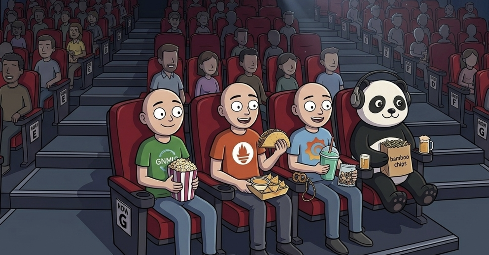

# Bitt meets the Telemetry Stack

_Bitt had been looking forward to this for weeks. The Super Mario Galaxy Movie. Opening weekend. And he finally had people to invite. Three of them — Prometheus, Grafana, and gnmic — the newcomers who moved into the network for Phase 6._

_They all agreed to come. Bitt bought snacks. What could go wrong._

  

---

## ACT ONE — The Queue

_The four of them are standing in line outside Theater 7. The queue wraps around twice. Bitt is holding four tickets and a slightly-too-large bag of bamboo chips. Prometheus has a pocket notebook out. Grafana is photographing the poster. gnmic is silently eating popcorn._

**Bitt:** Okay, I have to say it — I can't believe you all actually showed up. Last time I invited someone to a movie, it was Ethernet1, and Ethernet1 went down an hour before the showing.

**Grafana:** Bitt, sweetie, we LOVE that you invited us. This is going to be so fun. I already mapped out the optimal seat layout. Row G, seats 4 through 7. Center-aisle-adjacent. Perfect sight lines. I have a diagram.

**Prometheus:** _(writing in notebook)_ Queue length: 47 people. Average intake rate: 3 per minute. Estimated wait: 15.6 minutes. Plus trailers — 12 minutes. Plus ads — 8 minutes. We will sit down at approximately 7:42 PM.

**Bitt:** That's... very specific.

**Prometheus:** I count things. It's what I do.

**gnmic:** _(crunches popcorn)_

**Bitt:** gnmic, you've been quiet. Everything okay?

**gnmic:** Listening.

**Bitt:** To what?

**gnmic:** Everything.

**Bitt:** _(pause)_ Okay. So. For the people who haven't met you yet — can each of you introduce yourselves? I realized I've been working with you for a week and I still can't cleanly explain what each of you actually does.

**Grafana:** OH, me first! Me first! So — you know how in Mario Galaxy, Mario collects Power Stars? And there's that big observatory where you can SEE all the stars laid out on a map, and you can tell at a glance which galaxies you've been to? I'm the observatory. I'm the part where you LOOK at things. I don't collect the stars. I don't store the stars. I just make them beautiful.

**Bitt:** That's... actually really clear.

**Grafana:** I know. I'm good at this. Also my color palettes are immaculate.

**Prometheus:** _(still writing)_ I store the stars.

**Bitt:** Explain.

**Prometheus:** Every data point. Every timestamp. Every label. I write them all down. If you want to know what the interface counter on edge-1 was at 3:47 PM last Tuesday, I have it. I never forget. I will never forget. That is my entire purpose.

**Bitt:** That's kind of intense.

**Prometheus:** It's the job.

**gnmic:** _(crunches popcorn)_

**Bitt:** And gnmic... catches the stars?

**gnmic:** I catch the stars.

**Bitt:** ...Can you elaborate?

**gnmic:** _(sighs, sets down popcorn)_ The cEOS switches — edge-1, dist-1, dist-2 — they produce data constantly. Interface counters. BGP states. Memory stats. They don't just hold it. They stream it. Like warp pipes. Continuously flowing.

Someone has to stand at the other end of the warp pipe and catch what comes through. That's me. I subscribe to the paths I care about — `/interfaces/interface/state/counters`, `/network-instances/.../bgp/neighbors`, and so on — and the devices push data to me at whatever interval I specified. Every ten seconds for counters. On-change for BGP state. I catch it. I translate it. I expose it on port 9804 so Prometheus can take it.

**Bitt:** That's the longest sentence you've ever said.

**gnmic:** I said what was needed.

**Grafana:** _(to Bitt)_ gnmic doesn't small-talk. gnmic small-_works_.

**Bitt:** Okay, so — gnmic catches the data from the devices, Prometheus stores it, and Grafana shows it. Got it. But why all three? Why not one tool that does everything?

**Prometheus:** Because each of us is optimized for one thing. I am optimized for writing time-series data at high speed and answering queries about time ranges. I am _not_ optimized for rendering graphs. I have a web UI, yes, but it is — how do I say this politely — it is a developer tool.

**Grafana:** _(stage whisper)_ It's ugly, Bitt. His UI is SO ugly.

**Prometheus:** It is _functional_.

**Grafana:** _I_ am beautiful. _I_ have dashboards. _I_ have themes. _I_ have — speaking of which, Bitt, I LOVE what you did with the six-panel grid. The layout? Chef's kiss. Traffic on top, errors and discards in the middle, memory and overview on the bottom? That's storytelling. That's hierarchy of concern. That's me at my best.

**Bitt:** I learned from you, honestly.

**Grafana:** _(pleased)_ I know.

**gnmic:** _(crunches popcorn)_

**Bitt:** Okay but — wait, the line moved. We're getting close.

**Prometheus:** 12 more people ahead of us. Approximately 4 minutes.

**Bitt:** ...Before I forget — why did you all move in at the same time? You know you're new here. Before Phase 6, we had Bantu polling the network every 30 seconds, and that was it. Why this sudden upgrade?

**Prometheus:** Because polling every 30 seconds is for people who don't care what happens in between.

**Grafana:** Oof. Shots fired.

**Prometheus:** I do not take shots. I state facts.

**gnmic:** Bantu asks, "is it up?" We say, "here is how up it is, at every moment, forever."

**Bitt:** ...That's actually poetic.

**gnmic:** _(crunches popcorn)_

**Bitt:** Let me make sure I have this right. Before you three showed up, the network had one way of knowing things — Bantu polls, Bantu gets a snapshot, Bantu reports. Now there's a second way — a continuous stream. The devices don't wait to be asked. They just... tell us everything, all the time.

**Prometheus:** Correct.

**Grafana:** And when something goes wrong at 3 AM, Bitt, you don't just know "it was down." You know when it started sloping badly. You know how long the degradation went on before failure. You know which metric moved first. You have _evidence_. Before us? You had a snapshot. After us? You have a recording.

**Bitt:** _(quietly)_ That's actually beautiful.

**Grafana:** _(nods approvingly)_

---

## ACT TWO — The Seats

_They make it inside. Grafana, as promised, guides the group to Row G, Seats 4–7, with the efficiency of someone who has done this professionally. Bitt is in the aisle seat. gnmic next. Prometheus. Grafana at the far end. The pre-show ads are playing._

**Bitt:** _(settling in with bamboo chips)_ Okay. gnmic — you said devices _stream_ data to you. But how? What's actually happening underneath?

**gnmic:** gRPC on HTTP/2. Old HTTP was one request, one response — you wanted new data, you asked again. Polling. Like SNMP. HTTP/2 keeps the connection open and lets the server push data continuously. gRPC turned that into a programming model — send one subscribe request, data flows until you stop it.

**Bitt:** So SNMP is "press A to check the star count." gRPC streaming is "the star count just shows up on your HUD in real time."

**gnmic:** Yes.

**Grafana:** That's actually clean, Bitt. You're getting good at this.

**Bitt:** Bigger question — what does this whole setup replace? If the three of you didn't exist, what would a network team use?

**Prometheus:** SNMP-based tools. Polling servers. Older databases. Legacy UIs.

**Grafana:** Zabbix. SolarWinds. PRTG. LibreNMS. Cisco Prime. Some are fine, most are dated. Poll-based, SNMP-reliant, monolithic. Dashboards that look like 1998.

**Bitt:** Harsh.

**Grafana:** True.

**Bitt:** And who actually runs this setup in the real world?

**Prometheus:** Cloud-native world adopted me first. Kubernetes clusters, microservices, container infrastructure. If a company runs anything on Kubernetes, I'm there.

**Grafana:** Netflix, Uber, Spotify, GitHub — I'm on their dashboards. SRE teams, DevOps teams, platform teams. Anywhere someone needs to _see_ what infrastructure is doing.

**gnmic:** Network engineering adopted us later. Cloud taught the industry that real-time observability works. Network teams watched and said — we want this too. I connect those worlds.

**Bitt:** So you three are kind of network engineering catching up to cloud engineering.

**Grafana:** About ten years late. But they got there.

**Bitt:** Specific job titles that deploy all three of you?

**Prometheus:** Network Reliability Engineers. Network Automation Engineers. Platform Engineers. SREs whose scope includes networking. NOC engineers at serious providers.

**gnmic:** Hyperscalers at scale — Meta, Google's own teams, Azure networking. Same pattern as ours, just thousands of devices instead of three.

**Bitt:** So if someone's learning this stack right now, they're learning what modern teams actually use.

**Prometheus:** Yes.

**Grafana:** _(patting Bitt on the shoulder)_ You picked the right friends.

_The theater lights dim. The Nintendo opening chime plays. The four of them settle in._

**Bitt:** _(whispering)_ Last thing — if the counters come out wrong during this movie, Prometheus, it's on you.

**Prometheus:** _(whispering back)_ They will not come out wrong.

_The movie begins._

---

_Somewhere across the network, edge-1's in_octets counter ticked up by another 4,380 bytes. Prometheus noted it, even in the dark._
